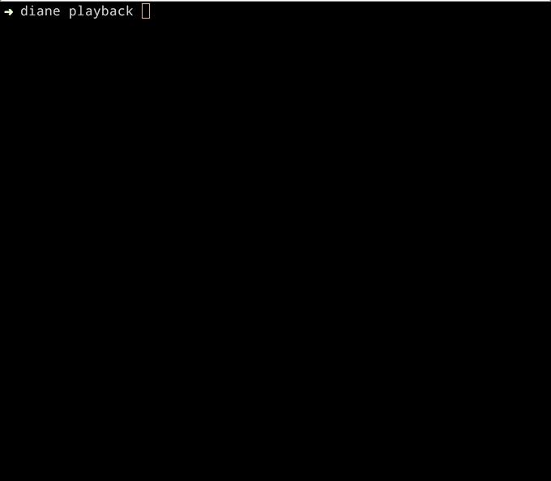

# Diane [](https://badge.fury.io/rb/diane) [](https://travis-ci.org/mnyrop/diane) [](https://codeclimate.com/github/mnyrop/diane/maintainability) [](https://codeclimate.com/github/mnyrop/diane/test_coverage) 
### A Ruby CL documentation utility for recording and playing back your thoughts/intel/motivations, without bloating the Git logs. ☕️

<br>

> *I have been assigned a secretary. Her name is Diane.*<br>
> *She seems an interesting cross between a saint and a cabaret singer.*

<br>


<br>

## Installation

Add this line to your application's Gemfile:

```ruby
gem 'diane'
```

And then execute:

    $ bundle

Or install it yourself as:

    $ gem install diane

<br>

## Usage

<br>



<br>


The gem is available as open source under the terms of the [MIT License](https://opensource.org/licenses/MIT).
